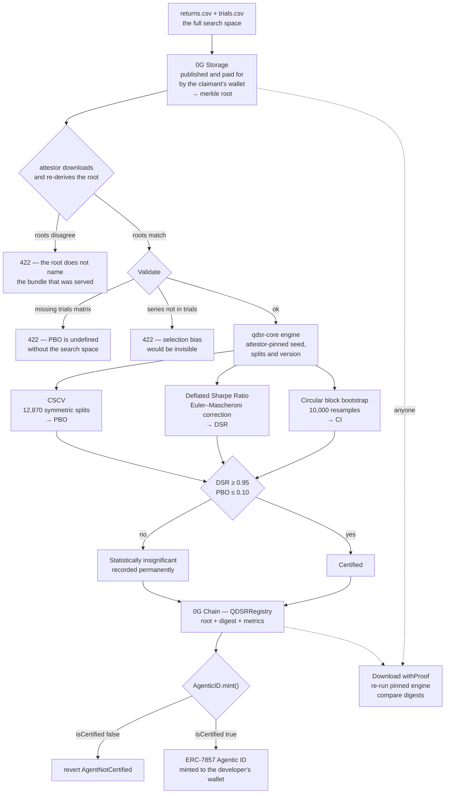

# Q-DSR Protocol

**Statistical certification for AI trading agents, gating ERC-7857 Agentic ID minting on 0G.**

Most published backtests are overfit. A strategy tuned across sixty parameter
configurations will produce an impressive Sharpe ratio on noise alone — and the
agent that ships it will market that number as competence.

Q-DSR makes an agent prove its edge before it can acquire an on-chain identity.
Evidence goes through the Probability of Backtest Overfitting and the Deflated
Sharpe Ratio. The verdict is anchored on 0G Chain. The evidence is published to
0G Storage. Anyone can re-run the computation and check the answer.

An agent that fails does not get a warning label. It does not get minted.

The developer mints from their own wallet — this server never holds a key that
could mint on their behalf. Its job is to hand over the exact arguments and to
say plainly whether the contract would accept them.

---

## The number that makes the case

Running the protocol against sixty pure-noise configurations, selecting the one
with the best in-sample Sharpe ratio — exactly what a naive optimiser does:

| | Overfit sample | Genuine edge |
|---|---|---|
| Observations | 756 | 1512 |
| Configurations tested | 60 | 60 |
| Annualised Sharpe | **1.24** | 3.01 |
| Deflated Sharpe Ratio | **0.4889** ❌ | 0.9999 ✅ |
| Probability of Backtest Overfitting | **0.5041** ❌ | 0.0000 ✅ |
| Verdict | **Statistically insignificant** | Certified |

The record lengths differ on purpose, and DSR is sensitive to that — three years
against six. The controlled version of this comparison is on the testnet: an agent
called Vega Lantern, the same kind of genuine edge as the right-hand column but
held to three years, [scores 0.9369 and is
refused](docs/DEPLOYMENT.md#completed-on-2026-08-20). A real edge that is not yet
provable at this sample size is still not provable.

Pure noise advertises a **1.24 annualised Sharpe ratio**. Its PBO is 0.5041 —
almost exactly one half, the textbook signature of a selection process carrying
no information at all. Its per-period Sharpe of 0.0780 is *lower* than the 0.0790
you would expect from luck alone across sixty trials.

That is the gap Q-DSR closes.

---

## Quick start

Requires Node 24+ and pnpm 10+. No database, no credentials, no chain access.

```bash
pnpm install

# terminal 1 — API
PORT=8080 pnpm --filter @workspace/api-server run dev

# terminal 2 — UI (proxies /api to :8080)
PORT=22107 BASE_PATH=/ pnpm --filter @workspace/qdsr-verification run dev
```

Open http://localhost:22107, click **Run verification**, then **Load overfit
sample**. The full path — submit, verify, seal, replicate — runs with nothing
configured.

Publishing the bundle asks the connected wallet for a storage payment before the
engine runs — that signature prompt is the claimant funding their own evidence,
not a mint. Then click **Anchor evidence**: the chain step reports that it has no
credentials rather than pretending to publish.

### Run the tests

```bash
pnpm --filter @workspace/qdsr-core   run test   # 89 — the statistics
pnpm --filter @workspace/contracts   run test   # 45 — the contracts
pnpm --filter @workspace/og-storage  run test   #  8 — 0G Storage
pnpm --filter @workspace/og-chain    run test   # 14 — 0G Chain
pnpm --filter @workspace/api-server  run test   # 37 — workflow + store contract
pnpm run typecheck                              # all packages
```

---

## How it works

### The gate, from the browser

The dashboard can ask the deployed contract what it would do, without spending
anything. The answer comes back in the contract's own vocabulary:

| Agent | The contract says |
|---|---|
| Certified (DSR 0.9999, PBO 0.0000) | *The contract would accept this mint.* |
| Insignificant (DSR 0.4889, PBO 0.5041) | *`AgentNotCertified` — the registry holds no passing verdict for this agent.* |

That refusal is a read-only `staticCall` against the real chain, not a disabled
button in our UI. The distinction matters: the gate is the contract's, and it
can be checked by anyone.



### The mathematics

Both tests come from the same body of work, and both are implemented from the
papers rather than approximated.

**Probability of Backtest Overfitting** — Bailey, Borwein, López de Prado & Zhu
(2014). Combinatorially Symmetric Cross-Validation partitions the track record
into 16 blocks and evaluates all `C(16,8) = 12,870` symmetric halves. For each
split it finds the in-sample winner and asks where that configuration lands in
the out-of-sample ranking. If it falls below the median about half the time, the
selection process carries no information.

**Deflated Sharpe Ratio** — Bailey & López de Prado (2014):

```
DSR = Z[ (SR̂ − SR₀)·√(T−1) / √(1 − γ₃·SR̂ + ((γ₄−1)/4)·SR̂²) ]

SR₀ = √V[SRₙ] · [ (1−γ)·Z⁻¹(1 − 1/N) + γ·Z⁻¹(1 − 1/(N·e)) ]
```

where `γ = 0.5772156649015329` is the Euler–Mascheroni constant. `SR₀` is the
selection-bias correction: the more configurations you tried, the higher a Sharpe
ratio luck alone should have produced, and the higher your bar.

> **DSR is a probability in [0,1], not a ratio.** It answers: given that this
> strategy was picked as the best of N attempts, and given how skewed and
> fat-tailed its returns are, what is the chance its true Sharpe is above zero?
> A DSR of 0.9842 is strong. A DSR of 3.61 is a category error.

**Performance.** A naive CSCV implementation costs `C(S,S/2) × N × T/2`
operations. Sharpe depends on the series only through `(Σx, Σx², n)`, and those
are additive across disjoint blocks — so precomputing per-block partial sums
turns each split into an `O(S·N)` aggregation. At `T=756, N=60` that is ~20M
operations instead of ~640M: **12,870 CSCV splits and 10,000 bootstrap resamples
complete in about 135 ms**, which is why verification feels live rather than
batched.

### Why not a TEE

The original design ran the Monte Carlo simulation inside a 0G Compute TEE.
Checked against the documentation: 0G Compute serves LLM inference and
fine-tuning, and its TEE attests *which model executed an inference request*.
There is no documented path for submitting an arbitrary compute job. The premise
was not buildable as stated.

The trust model was replaced rather than faked:

| | Original | Shipped |
|---|---|---|
| Basis of trust | TEE attestation | Deterministic recomputation |
| What a verifier does | Check a signature | Re-run the engine, compare digests |
| Detects a dishonest verdict | Yes | Yes — by anyone, publicly |

The evidence bundle — returns, the full trials matrix, and the parameters the
claim is about — is gzipped and published to 0G Storage under a merkle root, **by
the wallet making the claim**. A trials matrix is decimal text and compresses
about threefold: a 1512 × 60 bundle goes from 1,097,517 bytes to 384,359, which
is three times less of the claimant's money and the difference between an upload
the testnet indexer accepts and one that stalls past four minutes. The root, the metrics and a SHA-256 digest of the canonical
result go on chain. Anyone downloads the bundle `withProof`, re-runs the pinned
engine with the recorded seed, and must reproduce the digest byte for byte.

The engine's own output is deliberately not published. Bootstrap resamples and
CSCV logits are deterministic given those bytes plus the pinned seed and version,
so storing them would pay to keep something any verifier regenerates on the way
to checking the answer. `resultDigest` on chain is what pins the result.

That is scientific replication rather than hardware attestation. It is weaker as
a guarantee and stronger as a practice: disagreeing with us is cheap and public.

### Who pays, and who measures

Two different wallets, and the split is the point.

| Step | Signed by | Why that party |
|---|---|---|
| Publish the evidence bundle | **the claimant** | the party asserting a track record funds the record |
| `submitVerdict` | the attestor | the party being measured must not certify itself |
| `mint` | **the claimant** | the token is theirs, and their gas |

The attestor never accepts a bundle handed to it. It downloads the bytes at the
submitted root, re-derives the root, and refuses if they disagree — so a
submission cannot name one bundle on chain while being measured against another.
It also pins the measurement parameters itself: `cscvSplits` decides how PBO is
computed, and a claimant choosing it would be choosing how their own claim is
tested.

Cost following the claim closes a second thing. Evidence storage funded by the
operator is a free DoS surface — a megabyte per junk submission, paid by whoever
is running the service. Now it is paid by whoever submits.

**TEE execution is roadmap, not claim.** It is not implemented and is not
described as implemented anywhere in this repository.

---

## On-chain design

Two choices carry most of the weight.

**The certification rule lives on chain.** `submitVerdict` does not accept a
boolean. It takes measurements and derives the verdict from constants compiled
into the contract:

```solidity
uint32 public constant MIN_DSR_BPS      = 9_500;  // DSR ≥ 0.95
uint32 public constant MAX_PBO_BPS      = 1_000;  // PBO ≤ 0.10
uint32 public constant MIN_OBSERVATIONS =   252;  // one trading year
uint32 public constant MIN_TRIALS       =     2;  // DSR undefined below this
```

An attestor can be wrong about the numbers. It cannot certify an agent that
fails the published bar.

**Verdicts are append-only.** A failure is never deleted or overwritten.
Re-verification pushes a new entry; `hasFailedVerdict` stays true forever. The
permanence is the product.

`QDSRRegistry` implements `IOracle.verifyProof` — the hook the ERC-7857 reference
implementation already expects — so any ERC-7857 contract can consult Q-DSR
without modification. `AgenticID.mint` replaces the reference implementation's
owner check with `registry.isCertified(agentId)`.

**What conforms and what does not:** [docs/ERC7857.md](docs/ERC7857.md). The
interface, the ERC-165 identifier and the standard's events are implemented. The
confidentiality model is not — this protocol publishes its evidence so a stranger
can re-run it, and encrypting that would make the claim uncheckable. Sealed keys
are recorded and replaced but never re-encrypted, and the oracle hook is reused to
answer "is this agent certified" rather than "was this re-encryption valid". Those
are choices, and the document says so plainly rather than leaving a reviewer to
find out from the source.

### Live on 0G Galileo testnet

| Contract | Address |
|---|---|
| `QDSRRegistry` | [`0x34e2E62b6C0AA878781109E1D7E31bfBAF8C0950`](https://chainscan-galileo.0g.ai/address/0x34e2E62b6C0AA878781109E1D7E31bfBAF8C0950#code) |
| `AgenticID` | [`0x8559ec6DDe62450508846DB825B31f9722707687`](https://chainscan-galileo.0g.ai/address/0x8559ec6DDe62450508846DB825B31f9722707687#code) |

Source is verified — the `#code` tab shows Solidity, not bytecode. These addresses
carry the post-audit contracts; see [DEPLOYMENT.md](docs/DEPLOYMENT.md) for what
changed and which deployments they superseded.

**Both 0G components are live.** Verdicts and Agentic IDs go to 0G Chain; evidence
bundles and token artwork go to 0G Storage, where the root hash in a verdict
resolves to bytes anyone can fetch. That is what turns "you can re-run this" from
a claim into an instruction.

### What an Agentic ID carries

`tokenURI` is built in the contract, so the certification numbers travel with the
token rather than living behind a URL someone has to keep serving:

```json
{
  "name": "Cinder Delta #1",
  "description": "Market-neutral basis strategy on ETH perpetuals…",
  "image": "https://indexer-storage-testnet-turbo.0g.ai/file?root=0x50ecc67a…",
  "external_url": "0g://storage/0x2f20038b…",
  "attributes": [
    { "trait_type": "Verdict", "value": "Certified" },
    { "trait_type": "Deflated Sharpe Ratio", "value": "0.9999" },
    { "trait_type": "Probability of Backtest Overfitting", "value": "0.0000" },
    { "trait_type": "Configurations tested", "value": 60 },
    { "trait_type": "Observations", "value": 1512 }
  ]
}
```

The metrics are read live from the registry, not copied at mint time — a token
whose agent later fails re-verification stops claiming to be certified. Artwork is
optional: with none supplied the contract draws an SVG from the agent's own DSR
and PBO, so a token always renders.

### Audit

These contracts have no proxy, no pause and no upgrade path, so they were reviewed
before the deploy rather than after it. Four findings, each reproduced against the
live code, fixed, and held down by a regression test that fails on the previous
version: **[docs/AUDIT.md](docs/AUDIT.md)**.

The most serious was markup injection — `_escape` did JSON escaping and was used to
build the SVG, so an agent named `</text><script>…</script><text>` shipped a live
script tag into every wallet that rendered the token.

### Deploying

Full runbook: **[docs/DEPLOYMENT.md](docs/DEPLOYMENT.md)**. Three staged gates —
a local node, then the Galileo testnet, then mainnet — each of which has to pass
before the next begins.

```bash
# stage 0 — a local node, costing nothing
pnpm --filter @workspace/contracts run node          # terminal 1
pnpm --filter @workspace/contracts run deploy:local  # terminal 2
pnpm --filter @workspace/contracts run validate:local

# stage 1 — testnet (key goes in contracts/.env, which is gitignored)
pnpm --filter @workspace/contracts run preflight:testnet
pnpm --filter @workspace/contracts run deploy:testnet
pnpm --filter @workspace/contracts run validate:testnet
```

`preflight` refuses to proceed on an unreachable RPC, a chain-id mismatch or an
unfunded deployer. `validate` deploys nothing — it exercises an existing
deployment with 15 checks, including a mint that reverts for an uncertified
agent and the same mint succeeding once a passing verdict is recorded.

Stage 0 has been run end to end: the API server anchored a certified verdict and
an insignificant one to a live node, and the on-chain mint gate answered ALLOWED
and `AgentNotCertified` respectively.

Addresses and explorer links are written to `contracts/deployments/<network>.json`.
Set `QDSR_REGISTRY_ADDRESS`, `OG_RPC_URL` and `OG_PRIVATE_KEY` on the API server
to start anchoring.

| Network | Chain ID | RPC | Explorer |
|---|---|---|---|
| 0G mainnet | 16661 | `https://evmrpc.0g.ai` | `https://chainscan.0g.ai` |
| 0G Galileo testnet | 16602 | `https://evmrpc-testnet.0g.ai` | `https://chainscan-galileo.0g.ai` |

---

## Repository map

```
lib/qdsr-core/       the statistics engine — pure, deterministic, dependency-free
lib/og-storage/      0G Storage client (node + browser) + content-addressed fallback
lib/og-chain/        0G Chain client, ABIs, network parameters
lib/db/              Drizzle schema
lib/api-spec/        OpenAPI spec — source of truth for the client and Zod schemas
contracts/           QDSRRegistry.sol, AgenticID.sol (ERC-7857), Hardhat tests
artifacts/api-server/    Express API, run queue, anchoring, replication
artifacts/qdsr-verification/  React dashboard
docs/                design spec and architecture notes
```

`lib/qdsr-core` depends on nothing else in the workspace. It is the piece a
reviewer can verify without running any of the rest.

### Degradation, stated plainly

| Missing | Behaviour |
|---|---|
| `DATABASE_URL` | On-disk JSON store. Same `Store` interface, same contract tests. |
| A funded wallet, in the browser | **No fallback, by design.** Publishing is refused before the signature prompt, with the balance in the message. An operator-funded path would make "the claimant funds their own evidence" true only when convenient. |
| 0G Storage credentials, server side | Only affects reading back and the local seeder, which seals under its **real** 0G merkle root. `storageMode` is surfaced in the API and the UI. |
| 0G Chain credentials | Anchoring fails loudly with the names of the missing variables. The verdict and the evidence root survive; anchoring is retryable. |

Nothing silently pretends to have succeeded.

---

## Evidence bundle format

```
returns.csv    timestamp,return   — the submitted strategy, net of fees
trials.csv     T × N              — every configuration explored
```

`trials.csv` is mandatory, and the submitted series must appear as one of its
columns. A polished series that was never part of the declared search space makes
selection bias invisible, so the engine refuses it. Both refusals are tested.

---

## Status

Built for the 0G Bridge Buildathon by AKINDO, Wave 3.

- Statistics engine, contracts, API and UI: complete and tested (266 tests)
- Contracts audited before mainnet; four findings fixed, each with a regression
  test that fails against the previous code — see [AUDIT.md](docs/AUDIT.md)
- Deployed and source-verified on 0G Galileo testnet; 20/20 deployment checks
  pass, including a byte-for-byte match between the deployed runtime code and
  what this checkout compiles
- Evidence is published and funded by the wallet making the claim; the attestor
  re-derives the root from the published bytes before measuring anything
- Wallet-signed minting verified end to end by a human: Agentic ID
  [token #3](https://chainscan-galileo.0g.ai/nft/0x8559ec6DDe62450508846DB825B31f9722707687/3)
  is owned by the wallet that signed for it, not by this server, and carries its
  own DSR and PBO in on-chain metadata
- 0G Storage: integrated from both Node and the browser, verified to compute
  identical merkle roots across the two builds
- 0G Chain: integrated; contracts compiled and tested, mainnet deployment pending
- 0G Compute TEE: **not implemented** — roadmap, for the reasons above
